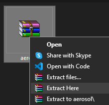

# ⭐ Starlapse 🌠

**Starlapse** is a Chrome extension that inverts the colors of your webpage to get a light/dark themed site on  any site you wish! [Download now](https://chromewebstore.google.com/) from the Chrome Web Store, or [directly download the zip](https://github.com/raghav-karn/starlapse/releases/latest/download/starlapse.zip). *By using Starlapse, you acknowledge that you have read and understood [our Privacy Policy](https://starlapse.raghavkarn.com/privacy-policy).*

> [!NOTE]
Some links in this README may not work at present, including the download link from Chrome Web Store and starlapse.raghavkarn.com. Otherwise, the extension is fully functional and can be downloaded from the [Releases](https://github.com/raghav-karn/starlapse/releases/latest).

> [!WARNING]
> **Starlapse** can prompt error at times. In such cases, try refreshing the tab or reload the extension. 

> [!IMPORTANT]
> To contact us, please reach out to [contact@raghavkarn.com](mailto:contact@raghavkarn.com). For help and support, please reach out to [help@raghavkarn.com](mailto:help@raghavkarn.com). Write us a review on the [Chrome Web Store](https://chromewebstore.google.com/detail/starlapse/jkkedagbmggnopjjjjodahkbpmolidje/reviews), open a [Issue on GitHub](https://github.com/raghav-karn/starlapse/issues) or send us your feedback at [feedback@raghavkarn.com](mailto:feedback@raghavkarn.com).

## 🤔 What's This All About?

Ever wished your favorite site had a dark mode? Or maybe you wanted to see how your favorite site looks in light mode? Starlapse is here to help! This extension allows you to toggle between light and dark themes on any website, giving you the flexibility to customize your browsing experience.

## 📸 Preview

## ✨ Features

- 🔍 **Easy to use**: With the click of a button, Starlapse's proprietary black hole TON-618 technology sucks in the colors you don't like and inverts into what you might like better.
- 🌎 **Works everywhere**: Starlapse works on every site that you want! Just note that it is not perfect...

## 🔒 Privacy Policy

**Starlapse stores absolutely no user data.**

- No personally identifiable information is collected
- No browsing data is sent to any servers and is processed locally
- No tabs details are tracked

For full details, please review our comprehensive [Privacy Policy](https://starlapse.raghavkarn.com/privacy-policy).

## 🚀 Installation

1. Download the latest .zip file from either the Releases, the `starlapse.zip` file in the root of [the repo](https://github.com/raghav-karn/starlapse) or use the files in [`/extension`](https://github.com/raghav-karn/starlapse/tree/main/extension) folder of the repo.

2. Unzip the file in a location of choice on your computer.

3. Open Chrome or any other Chromium-based browser and open the extensions page (`chrome://extensions`).

4. Enable `Developer mode`, click `Load unpacked` and select the folder with the contents of unzipped `starlapse.zip` file.

5. There you have it—Starlapse has been installed on your browser. Enjoy!

## 💡 How to Use

### 1️⃣ Toggle the extension

### 2️⃣ There's no step 2! Your website has been inverted!

## 🛠️ Made Using

- 🌐 HTML
- 🎨 CSS
- 📊 JS
- ✨ Some magically powerful TON-618 gravity

## 🤝 Contributing & Feedbacks
Your feedback and help matters! If you have any feature suggestion or have found a bug, please raise the issue on this repo. Also, Check out our [CONTRIBUTING.md](https://github.com/raghav-karn/.github/blob/main/CONTRIBUTING.md) for detailed guidelines. All contributions are welcome!

## Credits

- **Claude.ai** was a little used in fixing small issues like animating issues (still persists).
- **Figma** was used to create the icons.
- **Hack Club Browserbuddy** for intiating this whole process!

## 📝 License

This project is licensed under the MIT License - see the [LICENSE](LICENSE) file for details.

---
Starlapse by [Raghav Karn](https://github.com/raghav-karn)
- Extension made for [BrowserBuddy](https://browserbuddy.hackclub.com)
